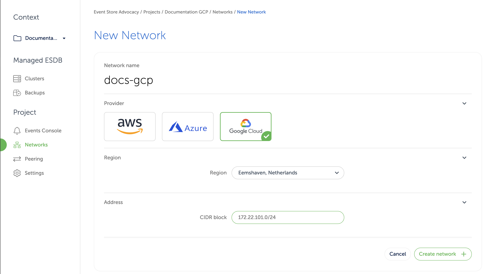
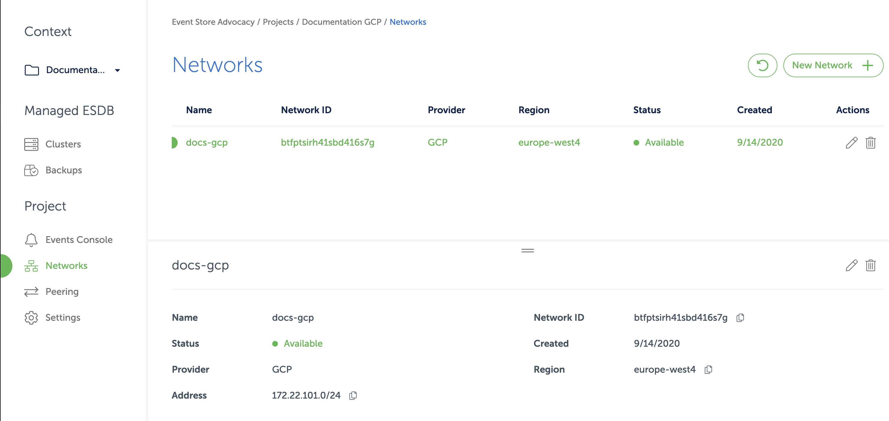
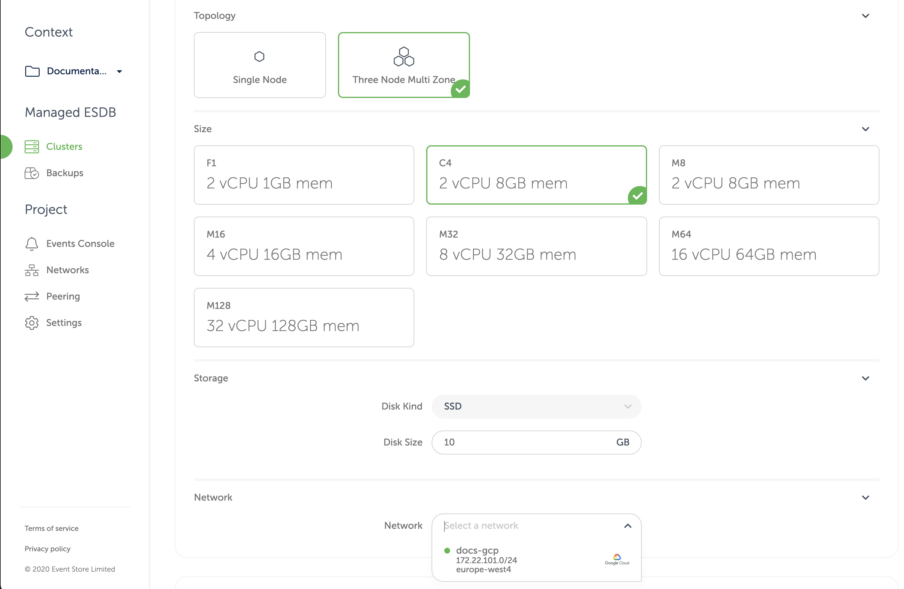
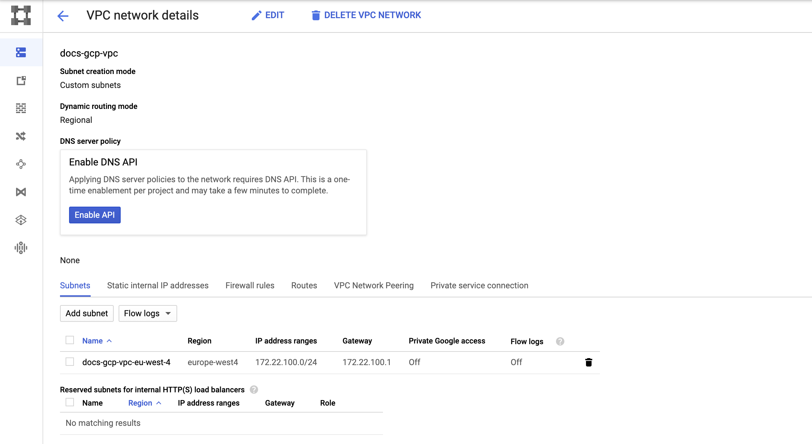
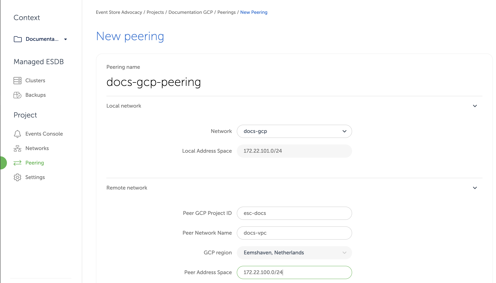
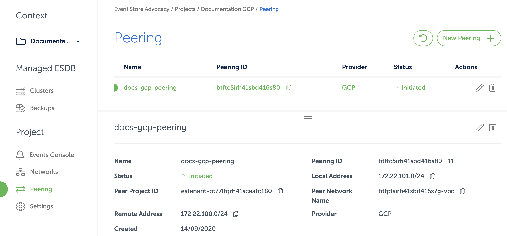

# Cloud EventStoreDB in GCP

For Google Cloud customers, Event Store Cloud allows provisioning an EventStoreDB cluster in the same cloud. You can create a cluster in the same region to ensure lowest latency.

Pre-requisites:
- You are a Preview customer of Event Store Cloud
- You have an organisation registered in Cloud console
- You can login to the Cloud console as admin
- Your organisation has at least one project
- You are the admin of the project
- You have access to create Google Cloud resources in the GCP project of your organisation

The provisioning process consists of three steps:
1. Create a network in Event Store Cloud
2. Provision the EventStoreDB instance or cluster
3. Peer the new network with your own network in GCP

## Create a network

In the Event Store Cloud console, go to the [project context](../../quick-start.md#projects) and switch to `Networks`. Then, click on the `New network` button.
 
 Make sure to fill out the required information:
 - Network name
 - Cloud provider - GCP
 - Region - choose the GCP region
 - CIDR block - the new network address range
 
::: el-card :body-style="{ padding: '0px' }" 

:::
 
 In order to establish a connection between the cluster network and your own cloud network, you'd need to peer them. Currently, Event Store Cloud only supports peering within the same region. Therefore, ensure that you choose the same region as your own cloud network.
 
 The network address range should not overlap with the address range of other networks in the same region and with your own GCP network, which you will be peering with. As any other cloud network, the CIDR block needs to be within the range specified by RFC1918.
 
After specifying all the details, click on the `Create network` button. You will be brought back to the networks list where the new network will appear as being provisioned. The provisioning process in GCP might take a little while. You'd need to click on the refresh button from time to time as the view won't update automatically.

::: el-card :body-style="{ padding: '0px' }" 

:::

By clicking on the network in the list you can inspect the details like its name, status, region and address range.

Wait until the network becomes `Active` in the list before moving to the next step.

## Deploy EventStoreDB

Within the project scope you can view EventStoreDB clusters for the project if you click on the `Clusters` menu. Initially, the cluster list is empty and you will only see the `New cluster` button.

When you click on the button, you get to the cluster creation form.

On the first part of the form you need to specify the new cluster name, the cloud provider (GCP) and the EventStoreDB version (currently it's only 20.6). Further, you need to choose the deployment size (single instance or three-node cluster) and whether to start server-side projections by default.

::: el-card :body-style="{ padding: '0px' }" 

:::

::: warning Projections impact performance
Both system projections and user-defined projections produce new events. Carefully consider the impact of enabled projections on database performance. Please refer to the [Performance impact](../../../server/5.0.9/server/projections/README.md#performance-impact) section of the projections documentation to learn more.
:::

The lower section of the form allows choosing the instance size for cluster nodes. Currently, only three instance sizes are available. The `F1` size is the lower-edge, aiming mainly to support testing scenarios and experiments due to its low price. Two other sizes - `C4` and `M4` are production-grade.

Moving forward, Event Store Cloud would have more instance sizes available.

::: el-card :body-style="{ padding: '0px' }" 

:::

Further, you need to specify the storage capacity. One one disk kind is available at the moment, but you can change the disk size. Since we allow customers to expand the storage size online without service interruptions, you can start with smaller storage and expand it when you need more capacity.

Finally, choose the network provisioned previously from the list. All cluster nodes will be attached to that network.

The screenshot above shows that we do not calculate the cluster price just yet, it will be available in a short while. Please consult the pricing schedule that we make available to all onboarded customers for more details.

Finally, when you click on `Create cluster`, the provisioning process starts and you will get a new cluster available after a few minutes.

## Network peering

When the cluster provisioning process finishes, you get a new cluster (or single instance), which is connected to the network created in the first step. You won't be able to connect to the cluster since the network is not exposed to the Internet. In order to get access to the network and consequently to all the clusters in that network, you'd need to peer the Event Store Cloud network to your own GCP VPC network. Normally, your GCP VPC network would be also accessible by applications, which you want to connect to the new cloud EventStoreDB cluster.

For this example, we'll use a VPC network in GCP in the same region (`europe-west-4`).

::: el-card :body-style="{ padding: '0px' }" 

:::

Notice that the VPC has one subnet in the same region as the Event Store Cloud network provisioned earlier.

The network page provide us enough details to start the peering process. In Event Store Cloud console, while in the same project context as the new network and cluster, click on `Peering` under the `Project` menu, then click on `New peering`.

Then, give the new peering a name and select the network created earlier. You'd need to fill out the remaining fields, using the information from GCP VPC.

| Peering form | GCP VPC screen |
| :----------- | :------------- |
| Peer GCP Project ID | GCP project ID, found in the project selection popup |
| Peer Network Name | The VPC name |
| GCP region | VPC subnet region, cannot be changed |
| Peer address space | VPC subnet address range |

For our example, here is the complete form:

::: el-card :body-style="{ padding: '0px' }" 

:::

When you click on the `Create peering` button, you'll be redirected to the peering list screen with the new peering resource being provisioned. After a little while, the status will change to `Intiated`.

::: el-card :body-style="{ padding: '0px' }" 

:::

The information on the peering details screen provides some essential information to complete the peering process from GCP side.

When the peering is initiated, get back to Google Cloud console and navigate to `VPC network peering`. There, click `Create connection` and then `Continue`. Give new peering a name and choose the network on GCP side. Next, fill out the remaining values using the initiated peering details:

| Event Store Cloud | GCP connection peering |
| :---------------- | :--------------------- |
| Peer Project ID | Project ID |
| Peer Network ID | VPC network name |

Expand the `Exchange custom routes` section and enable both `Import` and `Export` options for custom routes. It will instruct GCP to create routes automatically.

Here is how our example GCP peering form would look like:

::: el-card :body-style="{ padding: '0px' }" 

:::

Click the `Create` button and when in the `VPC network peering` list, click `Refresh` until the peering status changes to `Active`. The peering status in Event Store Cloud console should also change to `Active`.

At this moment, you should be able to connect to the EventStoreDB cluster in the cloud from any VM, which is connected to your GCP VPC network.

Depending on your set up, you might already have a connection available from your local machine to the GCP VPC using a site-to-site VPN. If not, ask your operations about the connection details.

## Next step

You are now ready to start using the new EventStoreDB cluster in the cloud. Follow to the [Using the cloud cluster](../../use) section to learn more.

 
