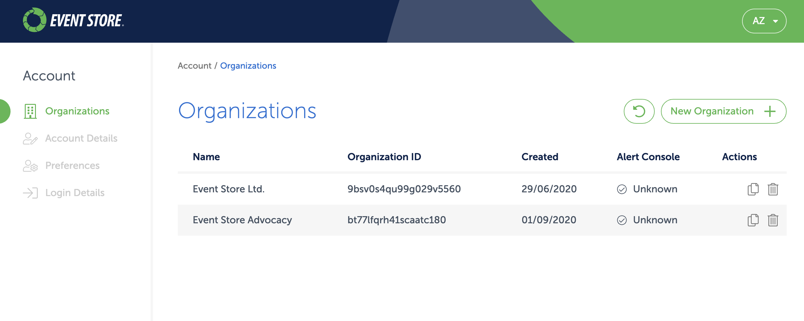
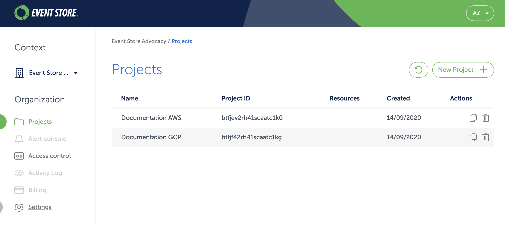
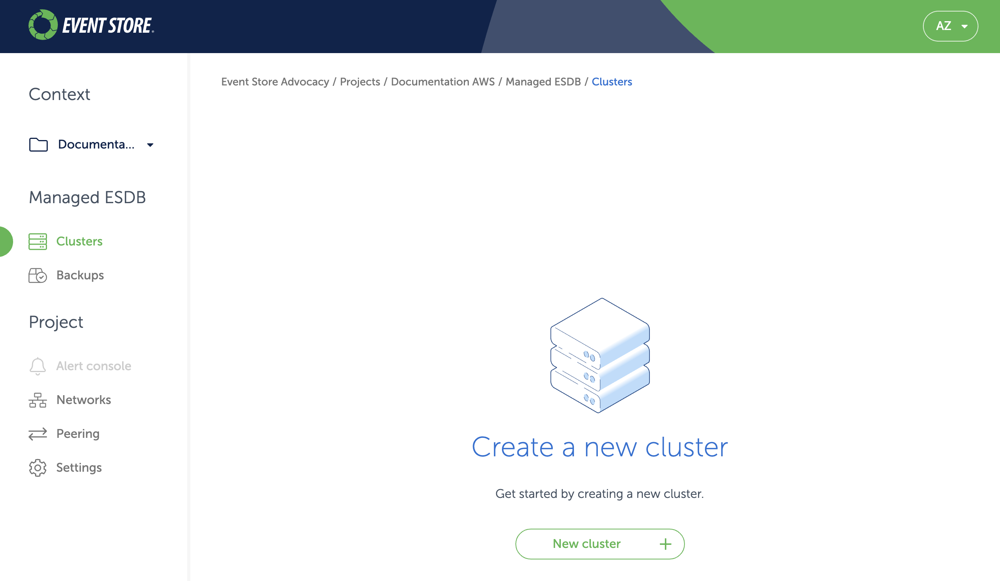

# Cloud quick start

Follow the steps in this guide to get access to the Event Store Cloud console, provision your first cluster and connect it to your cloud infrastructure.

## Get an account

Event Store offers a single sign-on (SSO) for our customers. Using a single account you get access to a variety of free and paid services.

At the moment, you need to visit out community forum ([Discuss](https://discuss.eventstore.com)) to create an account. If you already have an account at Event Store Discuss, you can use it for the Cloud console.

To get an account, open the [Discuss](https://discuss.eventstore.com) front page and click on `Log in`. There you get an option to sign up:

::: el-card :body-style="{ padding: '0px' }" 

:::

To finalize the sign-up process, you'd need to confirm your email address by clicking the link in the confirmation email. It might happen that the confirmation email doesn't get through, please check the junk email folder in your email client as you might find it there.

## Login to Cloud console

With the new account you can login to the [Cloud console](https://console.eventstore.cloud). From the console you can manage your organisations, users, projects and EventStoreDB clusters.

::: warning Preview customers only
Since Event Store Cloud is currently in preview, only a selected group of customers get the full set of features. You can only provision new clusters if you got onboarded as a Preview customer.
:::

In the console, you first get to the list of organisations, which you have access to.

::: el-card :body-style="{ padding: '0px' }" 

:::

::: tip Your first organisation
During the Preview phase, each customer gets an organisation created upfront by Event Store staff. That organisation is enabled for provisioning cloud resources.
:::

The Cloud console has the concept of Context. You'd normally be in the organisation context, or in the project context.

## Organisations

With your account, you might have more than one organisation. Each organisation has its own billing account and therefore is invoiced separately for all the resources within the organisation. For example, if you have several customers and want to have separate EventStoreDB cluster for each customer and also be able to bill the customer for the cloud resources, you can separate each customer in its own organisation.

When you click on an organisation in the list, you get to the projects screen, where you can see all the projects for the selected organisation.

::: el-card :body-style="{ padding: '0px' }" 

:::

Within the scope of the organisation, you also have the list of users and roles, billing information, alerts, and so on.

You can always switch to another organisation by clicking on the selected organisation name and either selecting the organisation from the list or clicking on `All organizations` to return to the list.

## Access control

Each organisation has its own access control. It includes the list of users, which have access to the organisation, groups, roles, policies and identity providers.

::: tip Preview functionality is limited
Some features like roles, policies and identity providers are currently not available in Preview. We will roll out all the access control features during the Preview phase, before Event Store Cloud reaches the GA status.
:::

When you create an organisation, you will be the organisation admin by default. To invite more people, click on the `Access control` menu and then switch to `Invitations`. There, you will see the `Invite member` button, which brings the invite screen. You'd need to enter the email address for the new member and also the group, which the invited member gets added to when they accept the invite.

When you invite someone, the invitation will stay in the `Invitations` list and will be inactive until the invite gets accepted. You can always resend the invite if the invitee accidentally removes it from their inbox.

Groups allow you to fine-tune access so not each organisation member would be the admin. The `Organization admins` group gets automatically created when you create a new organisation and members of this group have full access to the organisation.

Each project also gets its own `Project admins` group.

## Projects

An organisation can have multiple projects. Projects serve as a logical grouping of cloud resources. For example, you might create separate projects per environment (test, staging, production) or per application, where each application might have one cluster per environment.

To create a new project, click on the `New project` button. Then, enter the project name and add administrators from the list of organisation users. Each project also gets its own `Project admins` group and all the users, which you add as administrators when creating the new project will become members of this group.

When you click on a project in the projects list, you get to the project context screen.

::: el-card :body-style="{ padding: '0px' }" 

:::

Within the project context you can manage project clusters, backups, networks, etc.

By reaching this point, you are now ready to start provisioning cloud resources with Event Store Cloud. Follow one of the available guidelines for your cloud provider:

- [Amazon Web Services (AWS)](./provision/aws.md)
- [Google Cloud Platform (GCP)](./provision/gcp.md)
- Microsoft Azure (coming soon)

