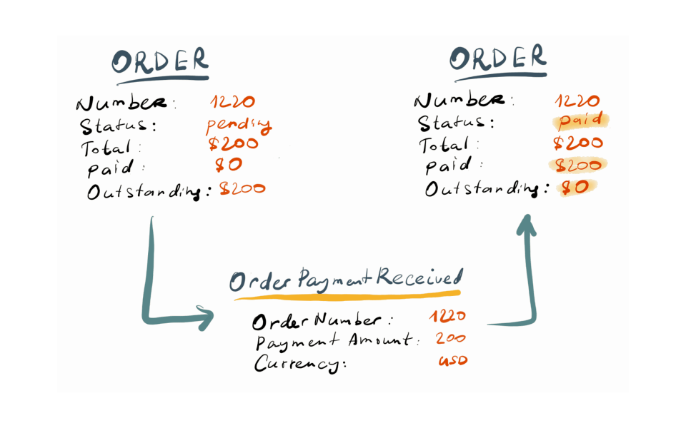
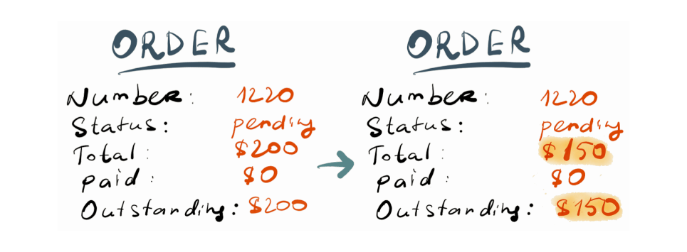
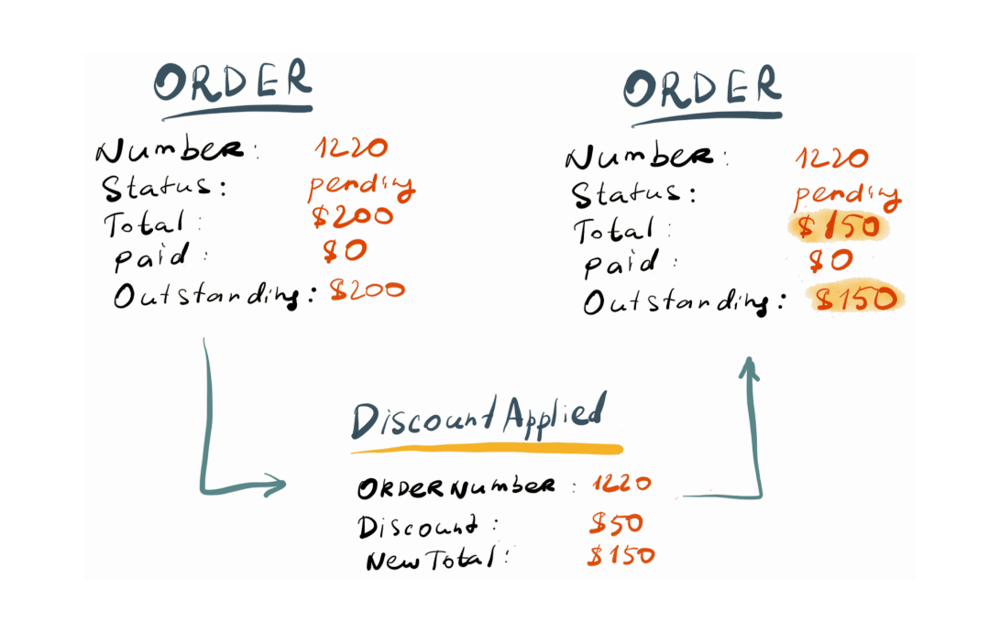

# Event Sourcing basics

## What is Event Sourcing

Event Sourcing is an alternative way to persist data. In contrast with state-oriented 
persistence that only keeps the latest version of the entity state, Event Sourcing 
stores each state mutation as a separate record called an event. 

<br />

::: el-divider
<i class="el-icon-reading"></i>
:::
_Model information about activity in the domain as a series of discrete events.
Represent each event as domain object._
::: el-divider content-position="right"
Eric Evans, Domain-Driven Design Reference
:::

<br />

Further in this section, we'll stick to the definition of Event Sourcing as Greg Young 
formulated it back in 2007, based on concepts from Domain-Driven Design. 
Therefore, in this section, we will use the terms "domain event" and "event" 
interchangeably.

## State-oriented persistence

All real-life systems store data. There is a vast number of different types of data storage, 
but usually, developers use databases to keep the data safe. Computerised databases 
appeared right after computers started to enter the business landscape. 

Hierarchical databases were quickly outlived by relational databases that started their 
ascendance in the 1970s when the first query languages called QUEL and SEQUEL appeared. 
Since the 1980s, when SQL became the standard query languages for relational databases 
and various RDBMSes like Oracle, IBM DB/2, and Microsoft SQL Server started to dominate 
the world of data persistence.

However, with the rise of object-oriented programming, which became mainstream 
in the late 1990s, developers started to struggle to persist objects in relational 
databases. Such a struggle got the name "object-relational impedance mismatch". 
Alternative families of databases appeared over the decades to address the mismatch issues, 
starting from older object databases to more modern document databases. 

Albeit, no matter what database kind the application uses, all that is stored in 
the database is the current state of the system. Essentially, all DMBSes support 
four basic operations for persistence - create, read, update and delete (CRUD). 

System objects usually are persisted as database records - rows in tables or documents. 
It means that when the object changes, and the change needs to be persisted, 
the database record gets replaced by a new record, which contains updated values.

::: el-card :body-style="{ padding: '0px' }" 
 
:::

## Historical record

### Keeping the history

Often keeping only the current state of an entity is not enough. 
For example, for orders, we'd probably want to keep the history of status changes. 
When such a requirement is present, developers often choose to save a particular 
update history in a separate table or document collection. Such a history, 
however, only tackles a specific use case and needs to be built upfront. 

::: el-card :body-style="{ padding: '0px' }" 
 
:::

Even when such a solution gets implemented and deployed, there is no guarantee 
that tomorrow or next year, the business won't require keeping the record on 
other state changes. Again, all the history before the change that would keep 
such a record will be lost. Another issue with only keeping the current entity 
state is that all the changes that happen in the database are, by nature, implicit. 

<br />

::: el-divider
<i class="el-icon-reading"></i>
:::
_Change history of entities can allow access to previous states, but ignores the meaning
of those changes, so that any manipulation of the information is procedural, and often
pushed out of the domain layer._
::: el-divider content-position="right"
Eric Evans, Domain-Driven Design Reference
:::

<br />

Any change of a persisted entity is just another update, indistinguishable from 
all other updates. When we look, for example, at the `Order` entity and its `Status` 
property, if it gets updated to `Paid` or `Shipped` we could figure out (implicitly) 
what has happened. However, if the `Total` property value changes, how would we 
possibly know what triggered that change?

### Explicit mutations as events

When using domain events, which, in turn, use domain terminology (Ubiquitous Language) 
to describe state changes, we have an explicit description of the change.

::: el-card :body-style="{ padding: '0px' }" 
 
:::

The payment case might be a bit too simple to disclose the difference, so, 
let's use another example. Imagine that the total order amount changes for a 
different reason. Here is how the change would be done if we only keep the 
entity state:

::: el-card :body-style="{ padding: '0px' }" 
 
:::

Here an implicit update has been applied to the entity state, and the only 
way for us to know what happened is to look at some sort of audit trail or 
even the application log.

When we model state changes as domain events, we can make those changes explicit 
and use the domain language to describe the change. Below you can see that two 
completely different operations could've happened that lead to exactly the same 
outcome if we only look at the final state.

::: el-card :body-style="{ padding: '0px' }" 
 
:::

When a discount is applied to the order, the total amount changes.

::: el-card :body-style="{ padding: '0px' }" 
 
:::

Again, the total amount could also change for other reasons, like removing an 
order item.

### Domain event in code

So, how would a domain event look when implemented in code? It is a simple 
property bag. We have to ensure that we can serialise it for persistence, 
and, also, can deserialise it back when the time comes to read the event 
from the database.

```csharp
public class DiscountAppliedToOrder {
    public string OrderId { get; set; }
    public double DiscountAmount { get; set; }
    public double NewTotalAmount { get; set; }
}
```

<br />

::: el-divider
<i class="el-icon-reading"></i>
:::
_A domain event is a fully-fledged part of the domain model, a representation of
something that happened in the domain._
...
::: el-divider content-position="right"
Eric Evans, Domain-Driven Design Reference
:::

<br />

## Next step

So, Event Sourcing is the persistence mechanism where each state transition 
for a given entity is represented as a domain event that gets persisted to 
an event database (event store). When the entity state mutates, a new event 
is produced and saved. When we need to restore the entity state, we read all 
the events for that entity and apply each event to change the state, reaching 
the correct final state of the entity when all available events are read and 
applied.

In the next section, we'll see to implement the entity persistence using events.


