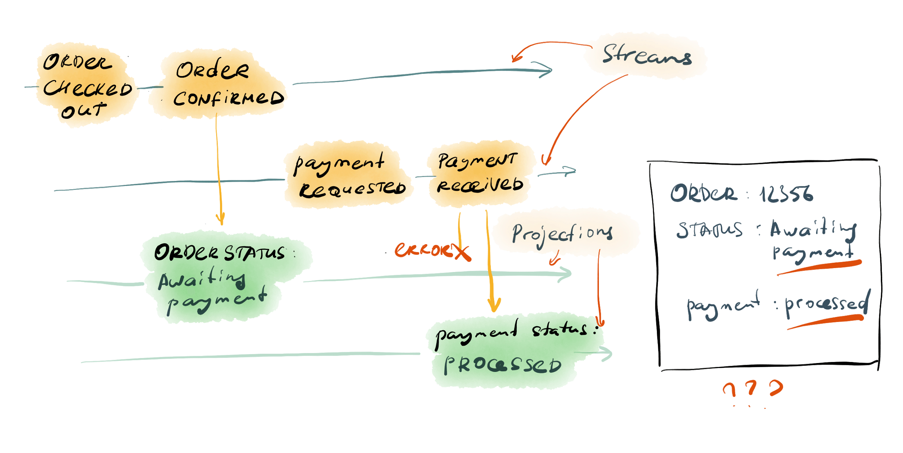
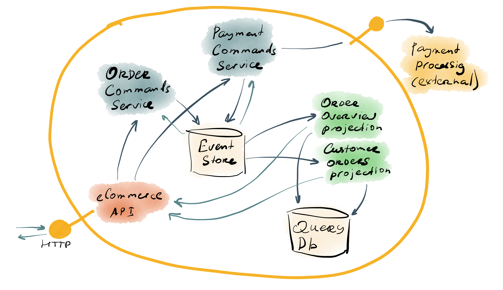

# Microservices

Over the last few years, the microservices pattern became known and well-adopted. The promise of microservices is appealing - create small autonomous components, eliminate dependencies, enable team autonomy. Low coupling and high cohesion - the holy grail of software development seems feasible to achieve when using microservices. 

However, as the Service-Oriented Architecture (SOA) produced a lot of controversy during the peak of its popularity and beyond, microservices, as "SOA done right" suffer from many misconceptions and fundamentally flawed implementation patterns.

In this section you will learn how the microservices architecture can be enriched with Event Sourcing, what benefits the synergy can bring and what can definitely go wrong.

## Service boundaries

The term "microservice" implies that a service can only be a "microservice" if it is small. The issue is that "small" is a subjective measure. For a codebase with a few millions lines of code for one monolithic application, anything less than ten thousand lines of code would be small. Some say that a microservice should be less than a thousand lines of code, or less than 300. These days, however, developers and architects turned back to the original service definition of SOA and try to define service boundaries that march with business capabilities.

::: el-divider
<i class="el-icon-reading"></i>
:::
_A service is the technical authority for a specific business capability._

_Any piece of data or rule must be owned by only one service._
::: el-divider content-position="right"
Udi Dahan, [The Known Unknowns of SOA](http://udidahan.com/2010/11/15/the-known-unknowns-of-soa/)
:::

There are, though, also technical capabilities, or capabilities that balance on the edge between being purely technical and serving the business still. For example, an email sending service, an authentication service, a PDF-generator - all those components can be perfectly isolated and deployed independently but don't necessarily benefit from the domain knowledge treasure since there is none. At the same time, some business capabilities might be very substantial in terms of complexity and therefore the size of the technical solution that implements such a capability.

The motivation for defining service boundaries around specific business needs is well-aligned with the Bounded Context pattern of Domain-Driven Design, although it's not the same. The business capability concept is closer to the definition of a _domain_, which is a part of the _problem space_. Bounded Context is an artefact of the _solution space_, so we might see the "technical authority", or the _service_ definition as something similarly defined. Each Bounded Context is a representation of a system, which doesn't necessarily consist of a single unit of deployment.

When it comes to the data sharing, the service boundary indeed sets strong limitations on whw can access the service databases directly. But, if we consider a service as a representation of a single Bounded Context, it is possible to have multiple independent components to live within the boundary and therefore access service databases directly. For this documentation, we will call those components "microservices".

## Microservice granularity

When using tactical patterns of Domain-Driven Design, some boundaries for microservices can appear naturally. For example, one service can encapsulate the capability of one Bounded Context. It's not a rule, nor a pattern but a good starting point.

If the context is large, operational concerns might require splitting it to multiple pieces. Since consistency is required for performing operations on the Domain Model, the smallest independent piece in such a system could be a single aggregate type. Operations on aggregates are executed within a transaction and that guarantees consistency if the aggregate boundaries are defined correctly. Outside of the Event Sourcing topic, there are a couple of videos that cover the topic really well, referenced below:

- [Bounded Contexts, Microservices, and Everything in Between](https://skillsmatter.com/skillscasts/11493-functional-cqrs#video) by Vladik Khononov (requires free registration) 
- [DDD & Microservices: At Last, Some Boundaries!](https://www.youtube.com/watch?v=yPvef9R3k-M) by Eric Evans

A system that is based on Event Sourcing and CQRS, moving parts can be separated to individual microservices. For example, a group of projections that use the same subscription, effectively work in isolation. Several concerns could trigger such a separation, like performance, deployment size and continuity, or different read model consistency SLA.

When deploying a projection group as an individual service, remember to keep together projections based on the functional scope of read models they produce. It is especially relevant if projections can reach out to each other data to fetch some missing data that is not conveyed by events they process. In such cases, it is important to ensure order and keep those projections in sync so read models could be stale but would never be inconsistent.

For example, an e-commerce system could have `Order` and `Payment` aggregates are in two different streams. Then, two projections will update the order status and payment status in different documents. The order status projection would also project the payment status so it marks an order as paid accordingly. Now imagine the payment status projection handles the event and the order status projection fails for some reason. If those documents used to compose a single screen, the user will be very confused.

::: el-card :body-style="{ padding: '0px' }" 

:::

Therefore, those two projections need to use the same subscription. In that case, the subscription won't progress if there's a transient error with, for example, a query database, until the error is resolved. So, the projected read model will be stale (the payment status won't get updated) but it will be consistent.

::: tip
The same applies to projections that all run in a single service. With microservices, however, the chance of getting a transient error caused by a deployment or a network glitch is much higher.
:::

::: warning
The design on that diagram is not what you would normally do. Preferably, the order payment status gets updated by the `OrderPaid` event, which can be a reaction to the `PaymentReceived` event.
:::

In the imaginary e-commerce Bounded Context, the component landscape could look like something shown on the illustration below.

::: el-card :body-style="{ padding: '0px' }" 

:::

There are a few individually deployed components and some of them share the same database. But, since they all belong to a single context or "service", such an architecture doesn't violate the fundamental SOA rule of not sharing databases across services.

::: warning
The illustration doesn't represent a reference architecture and serves an an example only.
:::

## Independent projections

Splitting the system into individual components comes with the cost. The system becomes explicitly distributed with all the potential issues associated with distribution.

::: tip
Read mode about [fallacies of distributed computing](https://en.wikipedia.org/wiki/Fallacies_of_distributed_computing) before considering to break your system into isolated components.
:::

Projections, at the same time, already have some characteristics of distributed computing. Therefore, some potential issues apply to projections even if they are hosted in a monolith. It's because projections process events that are stored in Event Store and have no direct connection to the Domain Model or the command side of CQRS. For that reason, projections are already independent, so moving them out to a separated component doesn't introduce a lot of risk.

There is, however, a benefit in having projections isolated. First, the command side can scale horizontally because it can handle concurrency. A subscription for projections is usually a single-threaded sequential event processor because it must process events in order. So, to scale a projection horizontally would require applying more advanced patterns like partitioning streams. It might not be necessary in many cases if the projection is fast and has enough resources to project events according to the consistency SLA.

Event Sourcing also enables creating multiple projections for the same events. You could project to different kinds of databases, like cache, relational, document and search databases. It would also be possible to create new aggregated views for new user-facing screens. Each of those new projections can be built entirely outside of any existing codebase and the only thing they need to share with the rest of the system is event contracts.

Some aggregating projections might form a Bounded Context on their own, like a reporting context. The risk here is to take a direct dependency on domain events that would make that context a _conformist_ against services, which produce events that the reporting context components will consume.

## Integration

Whilst using events for projections and reactions that live inside the same context does not create cross-context dependencies and therefore is considered safe, integration is another concern.

Services strive for autonomy as well as the teams that build those services. Therefore, integration using domain events should be used with caution. By using domain events from another system, those events become public contracts. The producer of such events will have a hard time iterating over their Domain Models, which highly relies on events. Therefore, it is often a good idea to create a subscription for domain events and convert them to public integration events. During the conversion, additional operations can be done. For example, you could enrich integration events by adding some information from read models, or by combining events.

By explicitly separating published external events from domain events, you can keep control of the Domain Model and Ubiquitous Language within the context. At the same time, you can keep external contacts stable by changing the converting subscription code only.

Such a conversion introduces additional moving parts to the system but it solves many potential issues. You might not need to implement such a conversion from the start, especially if there are no consumers for your domain events outside of the single context, controlled by one team. But as soon as the need for integration emerges, come back and consider splitting internal and external events, so only external events will be used as the public contract. In a way, it is not much different from versioning any other public API like messaging or HTTP APIs.

As for the delivery of external events, some use Event Store for that purpose. It is a legit pattern but it creates additional load on Event Store because each consumer would need its own subscription. More often than not, integration also doesn't require history. Therefore, it might be a better idea to use the conversion subscription to publish external events to a message broker instead. Message brokers do not keep the history (usually) and messages disappear as soon as they are consumed. Brokers are also very efficient when it comes to using the publish-subscribe pattern and have a great performance. A single subscription that converts domain events to integration events can therefore suffice to serve all the integration needs if it publishes external events to a broker.
