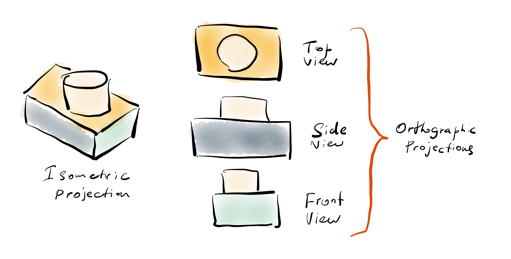
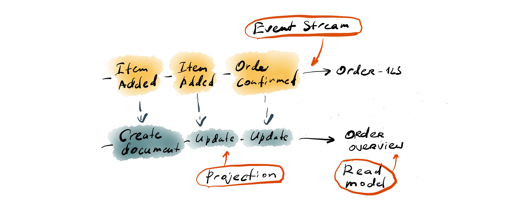

# Projections

By definition, a projection is a representation of an object using a different perspective. For example, isometric and orthographic projections allow us to represent a 3D object on paper using different points of view.



When we talk about projecting data, we usually mean representing the data differently from the form it was originally stored. For example, a relational database view is a projection. It uses a transformation query to represent a subset of data that is already available in the database, producing a derived result from that data. The view, however, is stateless and has no side effects - it doesn't change the original data in any way.

## Projecting events

The same applies to event projections with one difference. When projecting events, we have to store the state, so we have the latest snapshot of the projected state. It works somewhat similarly to materialised views that some relational databases support. Still, outside of its own state, such a projection doesn't manipulate the original data (events) in any way.

In CQRS, the query side is always a projection, even if it is not implemented as a stateful manner. When it comes to projecting events, we really want to keep the state of our read models in a queryable store to solve the issue of events streams being hard to query ad-hoc.

The idea is that the projection will receive all the events that it is able to project and will do the normal CRUD operations on the read model it controls, using the normal CRUD operations provided by the read model database (which could be anything).



Projections do the same thing as the `When` function in the [entity code](./entities-as-streams.md#using-events-to-mutate-state). Just as the entity state, the read model state is the left fold of all the event it processes. 

::: tip
Unlike the entity state, which is only applying events for that single entity, projections aren't limited to only process events of a single entity and can do aggregations for multiple entities, even for different types of entities.
:::

Keeping all this in mind, we can write code for a simple projection.

```csharp
public class OrderOverviewProjection {
    Database db;

    OrderOverviewProjection(Database db) => this.db = db;

    public void Project(object event) {
        var dbOp = GetOperation(event);
        db.Execute(dbOp);
    }

    DbOperation GetOperation(object event) {
        return event switch {
            OrderCreated e => new CreateOperation(
                new OrderOverview(e.OrderId, e.CustomerId)),
            ItemAdded e => Update(e.OrderId).With(x => x.Items.Add(MapItem(e.Item))),
            PaymentRequested e => Update(e.OrderId).With(x => x.Status = AwaitingPayment),
            PaymentReceived e => Update(e.OrderId).With(x => x.Status = Paid)
        }

        UpdateOperation<OrderOverview> Update(string id)
        {
            return new UpdateOperation<OrderOverview>(id);
        }
    }
}
```

Projections are usually dependant on specific infrastructure interfaces, since they work directly with databases that keep their read models.

## Subscriptions

Since the query model is used almost every time the application handles any type of query, wether a GET HTTP request or something else, we must ensure that the information stored in the read model is up-to-date. Therefore, we need to establish a real-time connection to the event store, so the projection receives events immediately after they are stored.

Event Store in particular provides a way to achieve that requirement. The most common implementation for client-side projections is to use catch-up subscriptions. The term "catch-up" comes from the fact that such subscriptions, when first connected to the server, will read all the historical events (catch up) and then automatically switch to real-time event processing.

With the Event Store .NET client, you can create a subscription like this:

```csharp
// Presumably we got IEventStoreConnection connection from somewhere

var subscription = connection.SubscribeToStreamFrom(
    stream: "mystream",
    lastCheckpoint: StreamCheckpoint.StreamStart,
    settings: CatchUpSubscriptionSettings.Default,
    eventAppeared: EventAppeared);
```

When you call the `SubscribeToStreamFrom` method, the subscription activates immediately. The `EventAppeared` function will be called for each event that already exists in the `mystream` stream. When all the historical events will be processed, the subscription will get to the real-time mode and starts receiving events as they are appended to the stream.

The `AppendStream` function could look like this, if we want to use our projection:

```csharp
Task EventSppeared(EventStoreCatchUpSubscription _, ResolvedEvent evt) {
    var domainEvent = DeserialzeEvent(resolvedEvent);
    projection.Project(domainEvent);
}
```

Of course, there's more plumbing involved in places like the `DeserializeEvent` function, which isn't covered here, since the aim of this article is to describe the concept. 
// TODO: Link to the practical article

## Checkpoints

The `SubscribeToStreamFrom` function requires you to specify the stream checkpoint in the `lastCheckpoint` parameter. In the example above, we used the `StreamCheckpoint.StreamStart` constant, which instructs the subscription to start reading events from the beginning of time (for that stream).

It will work, but it's not practical. When an application that hosts this subscription eventually stops and then starts again, the subscription will start catching up from the first event in the stream again. It defeats the purpose of having the read model state persisted in a database. If we'd allow our system to re-project all the events each time the projection starts, we could just keep all the read models in memory.

::: tip
It is, actually, a valid technique for caching and keeping the aggregate state snapshot available for command processing. Keep in mind how much time will be required to read all the events at the startup.
:::

In order to avoid re-projecting the whole history all over again, we can store the event offset, its position in the stream, after projecting the event. By doing that, we allow our system to load the stored checkpoint when the application starts again and subscribe from the last known position instead of the stream start.

With that in mind, the previous code snippet can be refactored to handle the checkpoint as well.

```csharp
// Startup code
var lastCheckpoint = checkpointStore.Load("mystream-checkpoint");
var subscription = connection.SubscribeToStreamFrom(
    stream: "mystream",
    lastCheckpoint: lastCheckpoint ?? StreamCheckpoint.StreamStart,
    settings: CatchUpSubscriptionSettings.Default,
    eventAppeared: EventAppeared);
```

In addition to the checkpoint loading code, we need to persist the checkpoint for processed events.

```csharp
Task EventSppeared(EventStoreCatchUpSubscription _, ResolvedEvent evt) {
    var domainEvent = DeserialzeEvent(resolvedEvent);
    projection.Project(domainEvent);
    checkpointStore.Save(evt.OriginalPosition.Value);
}
```

Now, when the application suddenly stops and then starts again, it will load the last known checkpoint and will subscribe from that stream position.

::: tip
The code snippet above uses two database operations for each processed event. It might introduce an issue known as _two-phase commit_ that has a possibility to execute only the first operation (read model update) but not the second (store the checkpoint) due to some transient failure. There are two ways to overcome the issue:
 - Use a database transaction to wrap both operations.
 - Make projections idempotent, so applying the same event twice won't bring the read model to an invalid state.
 :::
 
 This page covers the basics of projections, but you might've noticed that subscribing to a single stream won't deliver much of a value. Projections normally handle events of many entities. Read the [xxx guide](url) to learn more about the `$all` stream and projections that handle events from multiple streams.
 
